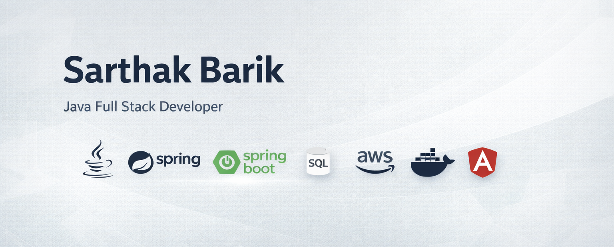

  

<h1 align="center">Hey there 👋, I'm Sarthak</h1>
<h3 align="center">Java | Spring Boot | Full-Stack Developer</h3>

  
  

---

## 👨‍💻 About Me
- 💻 Full-Stack Developer focused on **Java & Spring Boot**
- 🗄️ Strong in **SQL & Database Design**
- ☁️ Learning **AWS & Docker**
- 🐧 Comfortable with **Linux environments**
- 🚀 Building real-world backend projects

---

## 🛠️ Tech Stack

---

## 📊 GitHub Stats

  

---

## 📫 Connect With Me
- GitHub: https://github.com/sarthakbar
- LinkedIn: https://www.linkedin.com/
